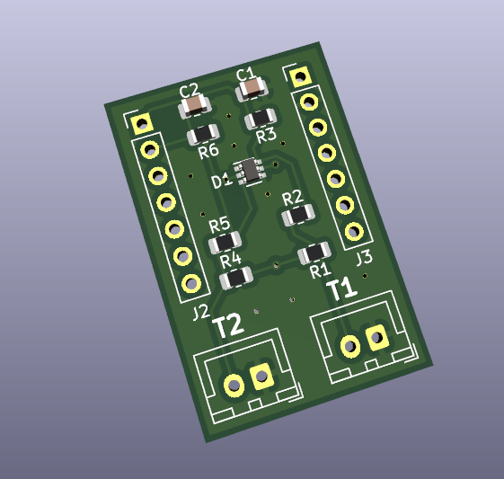
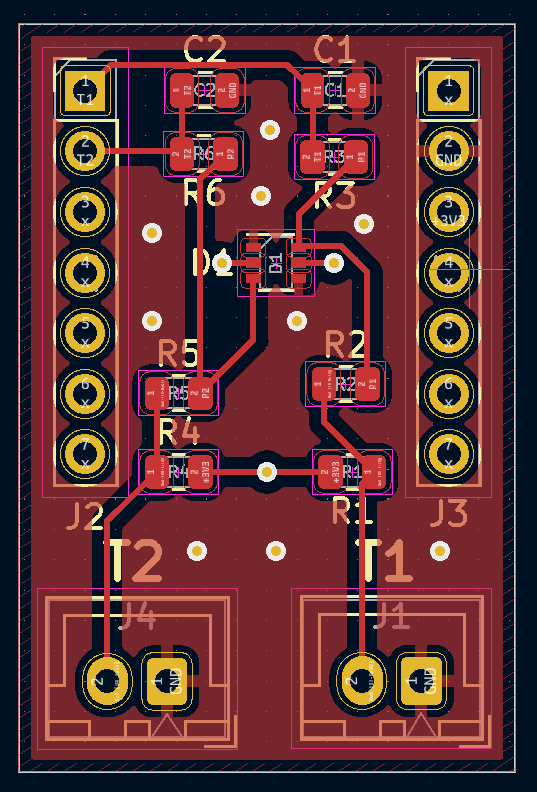
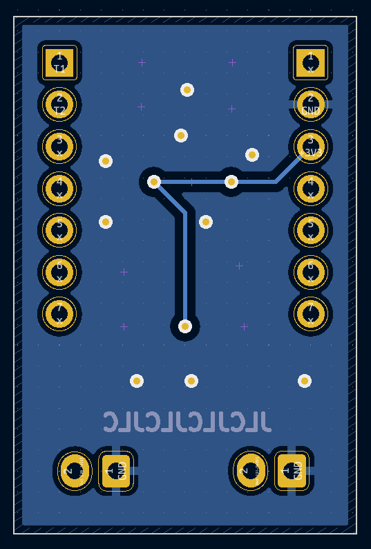

# OneMoreStupidThermistor

For when you need just one (or two) more stupid thermistor ports on your printer. This board takes an MCU of the Xiao or adafruit QT PY formfactor

# Images






# Seeduino Xiao Config Example
```ini
[mcu jomt]
serial: /dev/serial/by-id/usb-Klipper_samd21g18a_F6407A985733535020312E322A090CFF-if00
restart_method: command

#If using T1
[temperature_sensor chamber]
sensor_type: Generic 3950
sensor_pin: jomt:PA4

#If using T2
[temperature_sensor chamber]
sensor_type: Generic 3950
sensor_pin: jomt:PA5
```